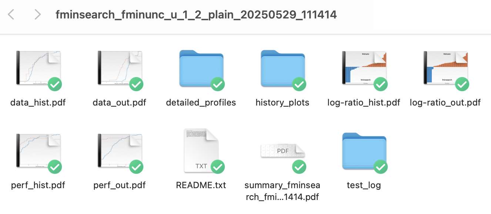
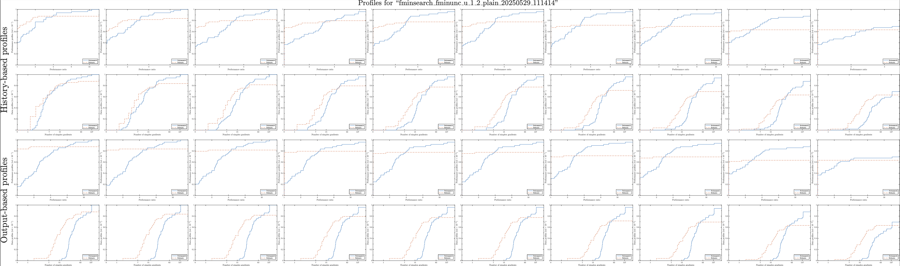

.. _use:

Usage for MATLAB
================

OptiProfiler provides a :ref:`benchmark <matbenchmark>` function. This is the main entry point to the package. It benchmarks given solvers on the selected test suite.

We provide below simple examples on how to use OptiProfiler in MATLAB. For more details on the signature of the :ref:`benchmark <matbenchmark>` function, please refer to the :ref:`MATLAB API documentation <matlabapi>`.

Examples
--------

Ex1: first example to try out
^^^^^^^^^^^^^^^^^^^^^^^^^^^^^

Let us first try to benchmark two callable optimization solvers **solver1** and **solver2** (e.g., **fminsearch** and **fminunc** in MATLAB Optimization Toolbox) on the default test suite.
(Note that each **solver** must accept signatures mentioned in the `Cautions` part of the :ref:`benchmark <matbenchmark>` function according to the type of problems you want to solve.)

To do this, run:

.. code-block:: matlab

    scores = benchmark({@solver1, @solver2})

This will benchmark the two solvers on the default test suite, which means ``'plain'`` feature (see :ref:`Feature <matfeature>`) and 49 unconstrained problems from the default problem library. It will also return the scores of the two solvers based on the profiles.

There will be a new folder named ``'out'`` in the current working directory, which contains a subfolder named ``plain_<timestamp>`` with all the detailed results.

   
   Figure 1: The subfolder structure containing detailed results of the benchmarking run.

Additionally, a PDF file named ``summary.pdf`` is generated, summarizing all the performance profiles and data profiles.

   
   Figure 2: Example of the summary.pdf file summarizing all the performance profiles and data profiles.

Ex2: one step further by adding options
^^^^^^^^^^^^^^^^^^^^^^^^^^^^^^^^^^^^^^^

You can also add options to the benchmark function. For example, if you want to benchmark three solvers **solver1**, **solver2**, and **solver3** on the test suite with the ``'noisy'`` feature and all the unconstrained and bound-constrained problems with dimension between 6 and 10 from the default problem set, you can run:

.. code-block:: matlab

    options.ptype = 'ub';
    options.mindim = 6;
    options.maxdim = 10;
    options.feature_name = 'noisy';
    scores = benchmark({@solver1, @solver2, @solver3}, options)

This will create the corresponding folders ``'out/noisy_<timestamp>'`` and files as in the previous example Ex1. More details on the options can be found in the :ref:`benchmark <matbenchmark>` function documentation.

Ex3: useful option **load**
^^^^^^^^^^^^^^^^^^^^^^^^^^^

OptiProfiler provides a practically useful option named **load**. This option allows you to load the results from a previous benchmarking run (without solving all the problems again) and use them to draw new profiles with different options. For example, if you have just run the second example Ex2 and OptiProfiler has finished the job and successfully created the folder ``'out'`` in the current working directory, you can run:

.. code-block:: matlab

    options.load = 'latest';
    options.solvers_to_load = [1, 3];
    options.ptype = 'u';
    options.mindim = 7;
    options.maxdim = 9;
    scores = benchmark(options)

This will directly draw the profiles for the **solver1** and **solver3** with the ``'noisy'`` feature and all the unconstrained problems with dimension between 7 and 9 selected from the previous run. The results will also be saved under the current directory with a new subfolder named ``noisy_<timestamp>`` with the new timestamp.

Ex4: customizing the test suite
^^^^^^^^^^^^^^^^^^^^^^^^^^^^^^^

OptiProfiler allows you to customize the test suite by creating your own feature and loading your own problem library.
For example, if you want to create a new feature that adds noise to the objective function and perturbs the initial guess at the same time, you can try the following:

.. code-block:: matlab

    options.feature_name = 'custom';
    options.mod_fun = @(x, rand_stream, problem) problem.fun(x) + 1e-3 * rand_stream.randn(1);
    options.mod_x0 = @(rand_stream, problem) problem.x0 + 1e-3 * rand_stream.randn(problem.n, 1);
    scores = benchmark({@solver1, @solver2}, options)

If you want to benchmark solvers based on your own problem library, you should do the following three steps:

1. Create a new subfolder (e.g., ``'myproblems'``) within the ``'problems'`` folder located in the optiprofiler project root directory.

2. Implement two MATLAB functions:

  - **<your_problem_library_name>_load.m**: Define a function that accepts a character or string representing the optimization problem name and returns a Problem class object (see :ref:`Problem <matproblem>`).

  - **<your_problem_library_name>_select.m**: Define a function that accepts a structure to specify desired problem characteristics and returns a cell array containing names of all problems in your library that satisfy the requirements. The structure may include fields such as ``ptype``, ``mindim``, ``maxdim``, ``minb``, ``maxb``, ``mincon``, ``maxcon``, and ``excludelist`` (these fields descriptions can be found in the :ref:benchmark <matbenchmark> function documentation in "Options for problems" part).

3. Use the benchmark function as before, but specify your desired problem libraries. For example, to use both the default S2MPJ library and your custom library in the subfolder ``'myproblems'``, you can run:

.. code-block:: matlab

    options.plibs = {'s2mpj', 'myproblems'};
    scores = benchmark({@solver1, @solver2}, options)

You may also refer to the README file in the ``'problems'`` folder for a detailed guide on how to create and use your own problem library via the OptiProfiler package.
