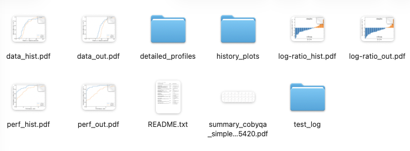
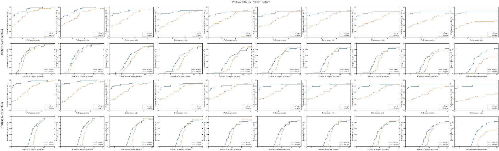

.. _use_python:

Usage for Python
================

OptiProfiler provides a :func:`~optiprofiler.benchmark` function. This is the main entry point to the package. It benchmarks given solvers on the selected test suite.

We provide below simple examples on how to use OptiProfiler in Python. For more details on the signature of the :func:`~optiprofiler.benchmark` function, please refer to the :ref:`Python API documentation <pythonapi>`.

Examples
--------

.. _py_example1:

Example 1: first example to try out
^^^^^^^^^^^^^^^^^^^^^^^^^^^^^^^^^^^^

Let us first try to benchmark two callable optimization solvers **solver1** and **solver2** on the default test suite.
(Note that each **solver** must accept signatures mentioned in the `Cautions` part of the :func:`~optiprofiler.benchmark` function according to the type of problems you want to solve.)

To do this, run:

.. code-block:: python

    from optiprofiler import benchmark

    scores = benchmark([solver1, solver2])

This will benchmark the two solvers under the default test setting, which means ``'plain'`` feature (see :class:`~optiprofiler.Feature`) and unconstrained problems from the default problem library whose dimension is smaller or equal to 2. It will also return the scores of the two solvers based on the profiles.

There will be a new folder named ``out`` in the current working directory, which contains a subfolder named ``plain_<timestamp>`` with all the detailed results.

   Figure 1: Screenshot of the subfolder containing detailed results of the benchmarking run.

Additionally, a PDF file named ``summary.pdf`` is generated, summarizing all the performance profiles and data profiles.

   Figure 2: Screenshot of the summary PDF file summarizing all the performance profiles and data profiles.

The subfolder ``test_log`` contains diagnostic files for the experiment. In
particular, ``test_log/report.txt`` records selected problem names, timing
information, and special cases detected while building the profiles: problems
where ``merit_init = phi(x_0) = inf`` (all solvers are declared to pass that
problem/run), solver runs that terminated abnormally, and solver outputs that
were replaced by the initial point as an output-based penalty. The file
``test_log/log.txt`` contains the messages printed during the run.

If history plots are enabled, each problem library has a subfolder under
``history_plots``. The top-level ``PROBLEM.pdf`` files keep the combined view
with both raw and cumulative-minimum histories. The ``raw`` and ``cummin``
subfolders contain the corresponding single-view PDFs. The merged
``*_history_plots_summary.pdf`` file uses the top-level combined PDFs.

.. _py_example2:

Example 2: one step further by adding options
^^^^^^^^^^^^^^^^^^^^^^^^^^^^^^^^^^^^^^^^^^^^^^

You can also add options to the benchmark function. For example, if you want to benchmark three solvers **solver1**, **solver2**, and **solver3** on the test suite with the ``'noisy'`` feature and all the unconstrained and bound-constrained problems with dimension between 6 and 10 from the default problem set, you can run:

.. code-block:: python

    from optiprofiler import benchmark

    scores = benchmark(
        [solver1, solver2, solver3],
        ptype='ub',
        mindim=6,
        maxdim=10,
        feature_name='noisy',
    )

This will create the corresponding folders ``out/noisy_<timestamp>`` and files as in :ref:`Example 1 <py_example1>`. More details on the options can be found in the :func:`~optiprofiler.benchmark` function documentation.

For the deterministic noisy variant from Moré and Wild's benchmarking model,
set ``noise_mode='deterministic'``. If ``n_runs`` is not provided, OptiProfiler
uses one run for this deterministic feature unless ``solver_isrand`` marks at
least one solver as randomized, in which case OptiProfiler uses five runs as
usual.

.. code-block:: python

    scores = benchmark(
        [solver1, solver2, solver3],
        feature_name='noisy',
        noise_mode='deterministic',
        noise_map='chebyshev',
    )

By default, ``n_jobs`` is set conservatively to about half of the available
workers instead of all workers. For the most reproducible timing experiments,
set ``n_jobs`` explicitly, for example ``n_jobs=1`` for sequential runs.

.. _py_example3:

Example 3: useful option **load**
^^^^^^^^^^^^^^^^^^^^^^^^^^^^^^^^^^

OptiProfiler provides a practically useful option named ``load``. This option allows you to load the results from a previous benchmarking run (without solving all the problems again) and use them to draw new profiles with different options. For example, if you have just run :ref:`Example 2 <py_example2>` and OptiProfiler has finished the job and successfully created the folder ``out`` in the current working directory, you can run:

.. code-block:: python

    from optiprofiler import benchmark

    scores = benchmark(
        load='latest',
        solvers_to_load=[0, 2],
        ptype='u',
        mindim=7,
        maxdim=9,
    )

This will directly draw the profiles for the **solver1** and **solver3** with the ``'noisy'`` feature and all the unconstrained problems with dimension between 7 and 9 selected from the previous run. The results will also be saved under the current directory with a new subfolder named ``noisy_<timestamp>`` with the new timestamp.

.. _py_example4:

Example 4: testing parametrized solvers
^^^^^^^^^^^^^^^^^^^^^^^^^^^^^^^^^^^^^^^

If you want to benchmark a solver with one variable parameter, you can define callables by looping over the parameter values. For example, if **solver** accepts the signature ``solver(fun, x0, para)``, and you want to benchmark it with the parameter ``para`` taking values from 1 to 3, you can run:

.. code-block:: python

    from optiprofiler import benchmark

    def make_solver(para):
        def solver_wrapper(fun, x0):
            return solver(fun, x0, para)
        return solver_wrapper

    solvers = [make_solver(i) for i in range(1, 4)]
    solver_names = [f'solver{i}' for i in range(1, 4)]
    scores = benchmark(solvers, solver_names=solver_names)

.. note::

    We use named functions (``def``) instead of lambda expressions here so
    that the benchmark can still run in parallel when ``n_jobs > 1``.
    See :ref:`py_callable_picklability` for the full list of affected
    callables and the rationale.

.. _py_example5:

Example 5: customizing the test suite
^^^^^^^^^^^^^^^^^^^^^^^^^^^^^^^^^^^^^^

OptiProfiler allows you to customize the test suite by creating your own feature and loading your own problem library.
For example, if you want to create a new feature that adds noise to the objective function and perturbs the initial guess at the same time, you can try the following:

.. code-block:: python

    from optiprofiler import benchmark

    def mod_fun(x, rand_stream, problem):
        return problem.fun(x) + 1e-3 * rand_stream.standard_normal()

    def mod_x0(rand_stream, problem):
        return problem.x0 + 1e-3 * rand_stream.standard_normal(problem.n)

    scores = benchmark(
        [solver1, solver2],
        feature_name='custom',
        mod_fun=mod_fun,
        mod_x0=mod_x0,
    )

.. note::

    Again, ``mod_fun`` and ``mod_x0`` are defined with ``def`` rather than
    ``lambda`` so that the benchmark can run in parallel when
    ``n_jobs > 1``. See :ref:`py_callable_picklability` for details.

Problem libraries may be distributed as independent Python packages. See
:ref:`python_problem_libraries` for installation and lifecycle management and
:ref:`python_problem_library_providers` for the supported providers. Once a
compatible package is installed, its public library name can be passed directly
to ``plibs``; no filesystem path is needed. For example, a package named
``optiprofiler-myproblems`` may register the library ``'myproblems'``, after
which it can be used as follows:

.. code-block:: python

    scores = benchmark(
        [solver1, solver2],
        plibs=['s2mpj', 'myproblems'],
    )

OptiProfiler discovers these packages without importing them. Their optional
dependencies are imported only when the corresponding library is selected for
a benchmark. See :ref:`python_custom_problem_libraries` to create a local or
installable provider.

Library-specific experiment options
~~~~~~~~~~~~~~~~~~~~~~~~~~~~~~~~~~~

Different problem libraries may expose entirely different options. Keep these
options separated by library name with ``plib_options`` instead of mixing them
with the common problem filters such as ``ptype``, ``mindim``, and ``maxdim``.
For example, using two hypothetical installable plugins:

.. code-block:: python

    scores = benchmark(
        [solver1, solver2],
        plibs=['myproblems', 'otherproblems'],
        plib_options={
            'myproblems': {
                'variant': 'large',
            },
            'otherproblems': {
                'data_split': 'validation',
            },
        },
    )

Each library validates only its own mapping. Options for a library not listed
in ``plibs`` and unknown option names are errors. ``plib_options`` is only for
runs that select problems from libraries; it is rejected with ``problem`` and
``load`` because those modes do not call a library adapter. The precedence is:

1. values in ``benchmark(..., plib_options=...)``;
2. process-level overrides from :func:`~optiprofiler.set_plib_config`;
3. environment or package configuration owned by the library;
4. the library's built-in defaults.

Use :func:`~optiprofiler.get_plib_config` to inspect the effective
process-level values. The per-experiment values do not mutate them. The raw
``plib_options`` supplied by the user are saved in ``options_user.pkl``. The
validated mapping with defaults filled in is saved in ``options_refined.pkl``
and, as one type-preserving serialized mapping, in the library's group in
``data_for_loading.h5``. These files are under the experiment's ``test_log``
directory.

Paths to external runtimes, licenses, compiled binaries, and caches are
installation concerns rather than benchmark semantics. A library should check
those in its availability hook instead of placing them in ``plib_options``.

For a local filesystem adapter or an independently distributed plugin, follow
:ref:`python_custom_problem_libraries`. The provider-authoring contract is kept
out of this quick-start tutorial so that ordinary benchmark usage remains
focused.

.. _py_example6:

Example 6: wrapping SciPy solvers with nonlinear constraints
^^^^^^^^^^^^^^^^^^^^^^^^^^^^^^^^^^^^^^^^^^^^^^^^^^^^^^^^^^^^

(See also the file in the repository: ``python/examples/scipy_cobyqa_wrapper.py``)

For nonlinearly constrained problems, OptiProfiler calls each solver with the
signature

.. code-block:: python

    x = solver(fun, x0, xl, xu, aub, bub, aeq, beq, cub, ceq)

where ``cub(x) <= 0`` contains the nonlinear inequality constraints and
``ceq(x) = 0`` contains the nonlinear equality constraints. SciPy's
``minimize`` interface represents constraints with objects such as
``Bounds``, ``LinearConstraint``, and ``NonlinearConstraint``. The adapter in
the wrapper below is the conversion from OptiProfiler's callback signature to
SciPy's constraint objects: linear constraints become ``LinearConstraint``
objects, while ``cub`` and ``ceq`` are wrapped as ``NonlinearConstraint``
objects with bounds ``(-inf, 0)`` and ``(0, 0)``, respectively. The SciPy
documentation for `COBYQA <https://docs.scipy.org/doc/scipy/reference/optimize.minimize-cobyqa.html>`_
and the `optimization tutorial <https://docs.scipy.org/doc/scipy/tutorial/optimize.html>`_
show this object-based constraint interface; see also the API references for
`LinearConstraint <https://docs.scipy.org/doc/scipy/reference/generated/scipy.optimize.LinearConstraint.html>`_
and `NonlinearConstraint <https://docs.scipy.org/doc/scipy/reference/generated/scipy.optimize.NonlinearConstraint.html>`_.

.. code-block:: python

    import numpy as np
    from scipy.optimize import Bounds, LinearConstraint, NonlinearConstraint, minimize

    def scipy_cobyqa_wrapper(fun, x0, xl, xu, aub, bub, aeq, beq, cub, ceq,
                             maxfev=200):
        constraints = []

        if bub.size > 0:
            # OptiProfiler gives aub @ x <= bub; SciPy stores it as a
            # LinearConstraint with lower bound -inf and upper bound bub.
            constraints.append(LinearConstraint(aub, -np.inf, bub))
        if beq.size > 0:
            # Equality constraints use identical lower and upper bounds.
            constraints.append(LinearConstraint(aeq, beq, beq))

        c_ub_x0 = np.atleast_1d(cub(x0))
        if c_ub_x0.size > 0:
            # Convert cub(x) <= 0 to a SciPy NonlinearConstraint.
            constraints.append(NonlinearConstraint(cub, -np.inf, np.zeros_like(c_ub_x0)))
        c_eq_x0 = np.atleast_1d(ceq(x0))
        if c_eq_x0.size > 0:
            # Convert ceq(x) = 0 by using zero lower and upper bounds.
            constraints.append(NonlinearConstraint(ceq, np.zeros_like(c_eq_x0),
                                                   np.zeros_like(c_eq_x0)))

        result = minimize(
            fun,
            x0,
            method='COBYQA',
            bounds=Bounds(xl, xu),
            constraints=constraints,
            options={'maxfev': maxfev},
        )
        return result.x

Then pass the wrapper to ``benchmark`` as an ordinary solver. Since
``benchmark`` compares at least two solvers, this example compares two
COBYQA wrappers with different function-evaluation budgets:

.. code-block:: python

    def scipy_cobyqa_short(fun, x0, xl, xu, aub, bub, aeq, beq, cub, ceq):
        return scipy_cobyqa_wrapper(
            fun, x0, xl, xu, aub, bub, aeq, beq, cub, ceq, maxfev=100
        )

    def scipy_cobyqa_long(fun, x0, xl, xu, aub, bub, aeq, beq, cub, ceq):
        return scipy_cobyqa_wrapper(
            fun, x0, xl, xu, aub, bub, aeq, beq, cub, ceq, maxfev=200
        )

    scores = benchmark(
        [scipy_cobyqa_short, scipy_cobyqa_long],
        solver_names=['SciPy COBYQA short', 'SciPy COBYQA long'],
        ptype='n',
        problem_names=['HS10', 'HS11', 'HS12'],
        mindim=2,
        maxdim=5,
        max_eval_factor=500,
        plibs=['s2mpj'],
        draw_hist_plots='none',
        n_jobs=1,
    )

.. _py_cautions:

Cautions
--------

.. _py_callable_picklability:

Callable arguments must be picklable when running in parallel
^^^^^^^^^^^^^^^^^^^^^^^^^^^^^^^^^^^^^^^^^^^^^^^^^^^^^^^^^^^^^

When ``n_jobs > 1``, OptiProfiler dispatches problems to worker
processes via :mod:`multiprocessing`. The following callable
arguments are sent across process boundaries and must therefore be
picklable:

- the entries of ``solvers``;
- feature options: ``distribution``, ``noise_map``, ``mod_x0``,
  ``mod_affine``, ``mod_bounds``, ``mod_linear_ub``, ``mod_linear_eq``,
  ``mod_fun``, ``mod_cub``, ``mod_ceq``;
- profile options: ``merit_fun``, ``score_fun``, ``score_weight_fun``.

**Lambda expressions and locally-defined nested functions are not
picklable.** If any of the callables above is a lambda, OptiProfiler
detects the failure when serializing the worker arguments and silently
falls back to sequential mode (``n_jobs = 1``), which can be much
slower.

To enable parallel execution, define these callables as module-level
functions using ``def``. For parametrized solvers, use a closure
factory (see :ref:`py_example4`) or :func:`functools.partial` instead
of a lambda.
